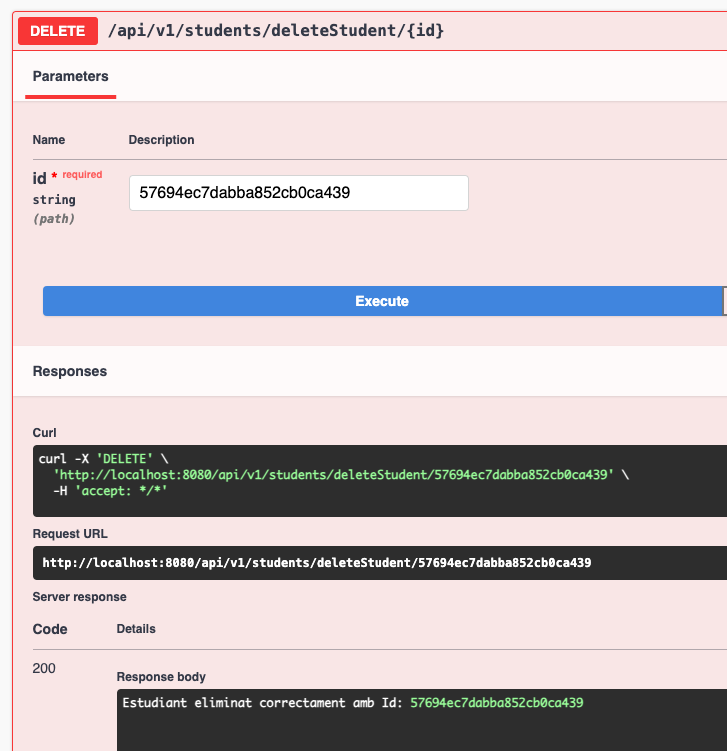

# Proves

### GET

- **Endpoint**: `/api/v1/student/{id}`
- 
- 

- **Endpoint**: `/api/v1/students/all`

- **Endpoint**: `/api/v1/students/cercaBirthYear90`
- 
- 

- **Endpoint**: `/api/v1/students/cercaNameAcabatEn`
- 
- 

### POST
- **Endpoint**: `api/v1/students/save`
- 
- 

### PUT
- **Endpoint**: `api/v1/students/update/{id}`
- 
- 

### DELETE
- **Endpoint**: `api/v1/students/deleteStudent/{id}`

# Preguntes de reflexió

## 1. Afegiu un endpoint que cerqui per un camp de tipus String on feu servir regex. Afegiu el que calgui al servei, repositori, etc.

## 2. Què caracteritza una api reactiva com aquesta i què la fa diferent d’una api síncrona amb MVC com les treballades anteriorment?
Una API reactiva és asíncrona i no bloquejant: processa les dades a mesura que arriben, sense ocupar fils innecessàriament. És ideal per a entorns amb moltes peticions o operacions lentes. 
En canvi, una API síncrona amb MVC és bloquejant: cada petició ocupa un fil fins que acaba, cosa que pot saturar el sistema si hi ha moltes connexions.

## 3. Què signifiquen Mono i Flux? Per a què penseu que serveixen i per què són útils en aquest tipus de programació?
Mono i flux són tipus especials que són part del projecte Reactor i s’utilitzen en programació reactiva.. 
Mono representa que pot ser 0 o 1 element, i és útil quan esperem una sola resposta. Com per exemple quan cerquem un estudiant pel seu id.
Flux representa que pot ser 0 0 n elements, i és útil quan esperem una llista de respostes. Com per exemple quan volem llistar tots els estudiants o cerquem quins estudiants van neixer en els 90.
Són útils perquè permeten manipular dades de forma funcional (amb map, filter, etc.) i gestionar fàcilment les operacions asíncrones, com per exemple, encadenar crides sense bloquejar fils del sistema.

## 4. Què és record? Un record utilitza getters i setters? Justifiqueu la resposta
Un record és una característixa que permet definir classes inmutables de forma molt concisa, pensada per contenir dades. 
No utilitza setters, és inmutable, un cop està creat, no es poden canviar els seus valors. Si utilirza getters, però no tenen el prefix get, sinó que són implicits amb el nom del camp, per exemple, si tenim record Student(String name), podem fer student.name() per obtenir el valor.
No cal definir-los manualment perquè el compilador els genera automàticament.

## 5. Un record no cal que tingui getters i setters es pot utilitzar directament. Un record tampoc cal afegir-li un constructor perquè ja el té per defecte. 
Exacte. Els records generen automàticament els getters, el constructor, equals(), hashCode() i toString(), de manera que només cal declarar els camps.
A més, com que són immutables, no tenen setters, i això fa que siguin molt útils per representar dades que no han de canviar, com els DTOs en una API.

